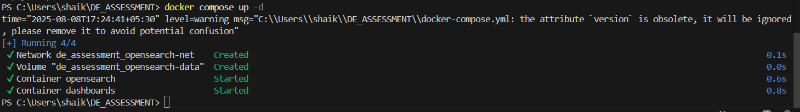
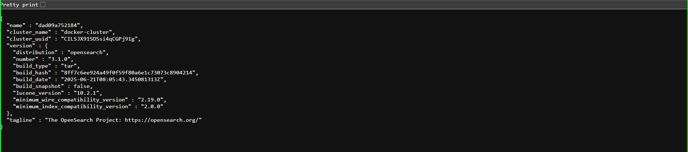
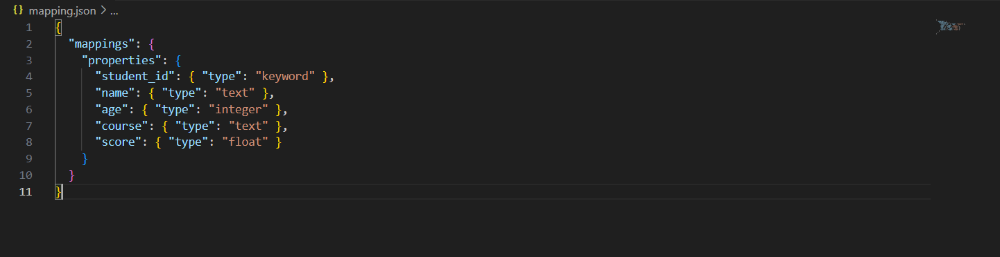
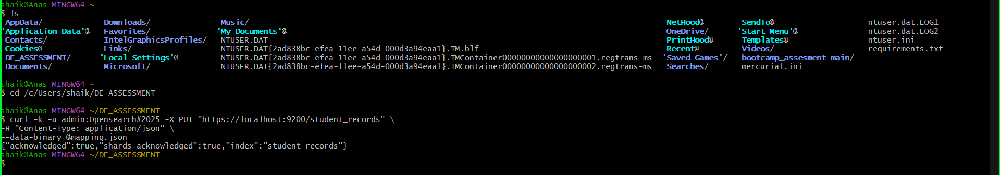
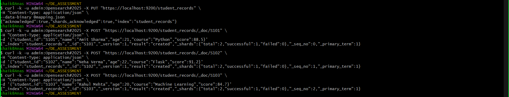
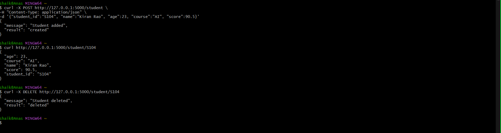
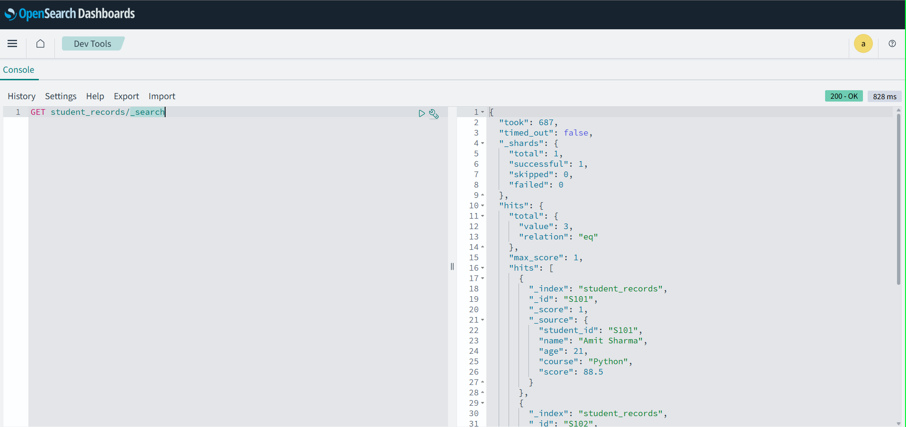

# 🧠 OpenSearch + Flask API Mini Project

## 📦 Tech Stack

- Python (Flask)
- OpenSearch 3.1.0
- OpenSearch Dashboards
- Docker + Docker Compose
- Git for version control

Step 1:
🐳 Container Setup Using Podman
For this project, I used Podman instead of Docker to manage containers. Since Podman supports Docker-compatible commands, the workflow remains largely the same.

I set up and ran the services using the following command:

bash
Copy
Edit
podman compose up -d
(To stop the services, use: podman compose down)

Once the containers were up and running, the following services became available:

OpenSearch REST API → https://localhost:9200

OpenSearch Metrics & Monitoring → https://localhost:9600

OpenSearch Dashboards (GUI) → http://localhost:5601

🔐 Access Credentials
Username: admin

Password: Opesearch@2025

step 2:
In this step, I focused on setting up the OpenSearch index and inserting initial sample data to work with.

To begin with, I created a file named mapping.json, which defines the schema (or mapping) for the student_records index. This schema outlines the structure of the documents that will be stored in the index — specifying field types such as keyword for student_id, text for name and course, integer for age, and float for score.

Step 3: Insert Sample Data Using curl in Git Bash
In this step, I inserted sample student data directly into the student_records index using curl commands via Git Bash. This allowed me to test the OpenSearch setup and confirm that the index was functional before integrating the Flask API.

🛠️ Tools Used:
Git Bash (for executing secure curl commands)

OpenSearch REST API (via HTTPS)

step 4:
 Develop Flask API with POST, GET, and DELETE Endpoints
In this step, I developed a lightweight Flask REST API to interact with the student_records index in OpenSearch. The goal was to provide an easy-to-use interface for performing CRUD operations, specifically focusing on:

POST – to add a new student record

GET – to retrieve a student record by student_id

DELETE – to remove a student record by student_id

I created a Python file named app.py, where I defined these endpoints using Flask routes. The API internally connects to OpenSearch using the opensearch-py client and performs the required operations securely over HTTPS with basic authentication.

To run the Flask app locally, I installed the necessary packages using pip, including:

Flask – for creating the API server

opensearch-py – to communicate with the OpenSearch backend

Result:

